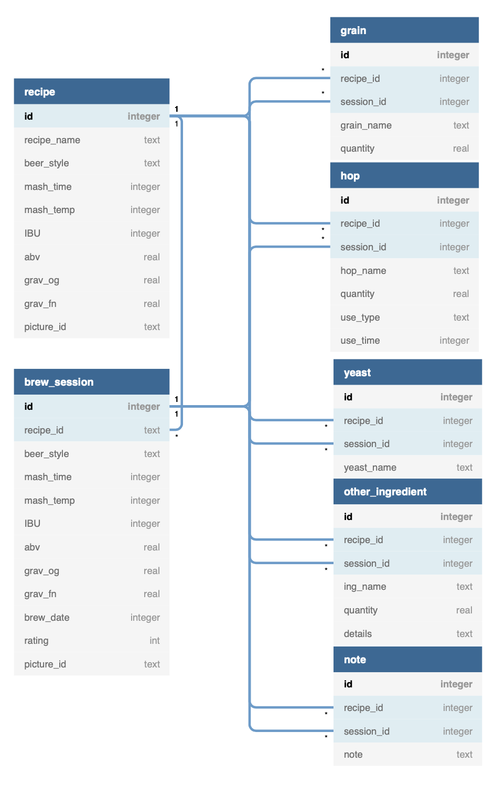

# BeerCraft

[BeerCraft Website](https://fbilo22.pythonanywhere.com)

# Table of contents

1. [Introduction](#Introduction)
2. [Database](#Database)
3. [Web-Application](#Web-Application)
4. [Authorization](#Authorization)
5. [Deployment](#Deployment)
6. [To be implemented and improvements](#Improvements)

## Introduction

BeerCraft is a simple web-app I created for 2 purposes:

- Learn how to develop a web-application
- Help me track my recipes and brew sessions for my beer crafting hobby

I completed this application while following [The Complete 2022 Web Development Bootcamp on Udemy](https://www.udemy.com/course/the-complete-web-development-bootcamp/)

The application is mainly built for personal use, but if you share the same hobby and would like to use it, you can send me a request and I'll give you the permission to edit and delete recipes and brew sessions.

You can also reach out if you have constructive comments and suggestions
[fbilo22@gmail.com](mailto:fbilo22@gmail.com)

## Database

The database is used to store recipes, brew sessions, ingredients and instructions/notes.

Since the requirements are very simple, I used the SQLite database

Database diagram:

## Web-Application

The Web-application is built using Python Flask framework and the MVC design

### Database Interaction

To improve my SQL skills, I used the sqlite3 library for Python to create interactions with the database and wrote my own SQL querries.

The website/db_utility.py file contains all functions interacting with the database

### Models

To facilitate managing recipes, a class as been created for each database table.
I added methods on a as-needed basis while building the controller part of the application.

All classes are located in the website/models.py file

Those methods mostly call the db_utility functions to create, get, update or delete items

In retrospect, and now that I have more experience, I should probably have created a diagram for each class and their methods before starting.

### Views (or Templates)

- HTML templates for the Front-end are located in the website/templates folder
- Images and user uploaded pictures are located in the website/static folder
- Custom CSS styles are stored in the website/static/css/styles.css folder

Bootstrap was used as css framework

### Controller

The controller part of the application is located in the website/views.py folder

This section defines the different routes for the web-application and calls the templates while providing the information to be displayed through the templates

Flask blueprints are used to isolate the Authentication and Views parts.

## Authorization

Since the app is designed for personnal use, there is no need for a complex authentication and authorization system. But to prevent anyone from deleting and modifying the recipes and brew session, a basic user management is required.

To simplify user-management, I implemented a free third party system:
[Auth0](https://auth0.com)

Only logged-in user will be able to create recipes and brew-sessions, and only users with the Administrator role will be able to edit or delete existing items.

All users, event logged out ones, will be able to see every recipes and brew-sessions

## Deployment

App is deployed on PythonAnywhere.com

## To be implemented and improvements 

- Create and Edit forms are very bare-bone. They could be stylized with CSS
- Home page Create new session is not functional: Currently, the user can creatre a brew session from a recipe page or from the screen to browse existing sessions from a recipe. To make this functional, I will need to implement a way for the user to select a recipe and generate the create session page from the selected recipe.
- Mobile navbar: The navbar on mobile does not display the items as intended. Could be improved to look better.
